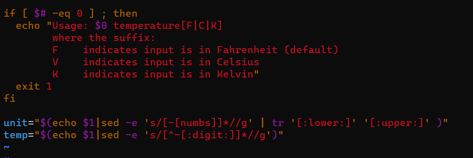
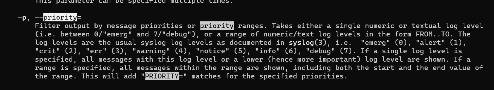

# Exam_2420

## Step 1
```
sudo apt update
sudo apt upgrade
```

## Step 2

I copied and pasted the code into vim, first adding a #!/bin/bash to see syntax highlighting and using /(thingtofind) I edited all of the echoes using the "i" key to allow me to insert missing components. In the few replacements I used the "r" hotkey to replace the contents. I finished with taking the shebang out.



## Step 3

jouranlctl -p 4 -o json-pretty --list-bootsx

At the top of the man page I started looking for the first feature which was printing logs for boot. I searched the man page with "/current boot" pressing "n" until I found the command --list-boots.


Next I searched for "/priorty", and found that I was able to filter by priority with -p and using 4 as the argument to do warning level or logs of higher priortiy.



and finally I found the option to output in in pretty json using the same search feature looking up "/json" as you can see in these screen shots


I'm guessing there is nothing to display with the 4 filter so I changed it to 7 to show that it was outputting something pretty.


## Step 4

```
#!/bin/bash


USERS=$(grep :[0-5][0-9][0-9][0-9]: /etc/passwd | grep -oE '[^:]+')
NEWLIST=[]

LOGGED_IN=$(who | awk '{ print $1 }')
echo "Regular users on the system are:"
echo $USERS

echo "Users currently logged in are:"
echo $LOGGED_IN

# code here to append to /etc/motd
```


## Step 5

```
[Unit]
Description=Runs the user information script to add to motd

[Service]
Type=oneshot
ExecStart=/bin/userinformation

[Install]
WantedBy=multi-user.target
```

## Step 6

```
[Unit]
Description=Runs the script at bootup and everyday

[Timer]
OnCalendar=* 01:00:00
DelaySec=60

[Install]
WantedBy=timers.target
```